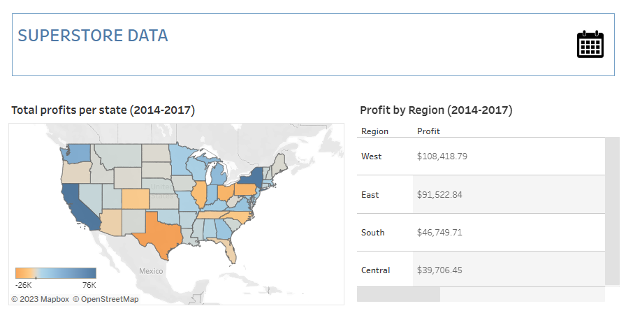
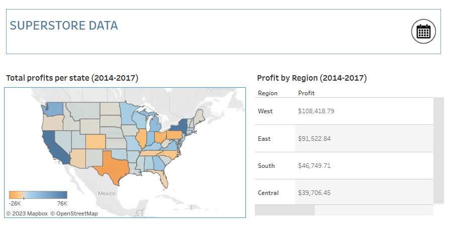

# Data Analytics for Superstore Sales

## Goal of the project

The purpose of this project is to identify the patterns in products, regions, categories and customer segments for efficiency and profit optimization. Main Business Objectives are:\
How can we optimize our profits?\
What are the emerging trends that we can we identify?\
How can we take these insights to build recommendations?

## Tableau Dashboard

The interactive Dashboards based upon Yearly and Quaterly sales aspects from 2014-2017 of collected data are shown in images while links are atatched below:

### Yearly
[](https://public.tableau.com/app/profile/usama.zafar.qureshi/viz/SuperstoreData_16929735714910/yearly)

Click [here](https://public.tableau.com/app/profile/usama.zafar.qureshi/viz/SuperstoreData_16929735714910/yearly?publish=yes) for yearly dashboard

### Quartly
[](https://public.tableau.com/app/profile/usama.zafar.qureshi/viz/SuperstoreData_16929735714910/quartly) 

Click [here](https://public.tableau.com/app/profile/usama.zafar.qureshi/viz/SuperstoreData_16929735714910/quartly?publish=yes) for quartly dashboard


## Analysis Approach

The following questions and topics will be stringed out from data to answer business objectives.\
Let’s load data into SQL and check the first 5 rows to make sure it imported well.

```SQL
Select TOP 5 *
FROM Superstore
```

### 1. What are total sales and total profits of each year?

First creating a year column from Date, which will be further use in analysis of data.
> To create a new column of year

``` SQL
SELECT DATEPART(YEAR, Order_Date) AS year
FROM Superstore

ALTER TABLE Superstore
ADD year INT

UPDATE Superstore
SET year = DATEPART(YEAR, Order_Date)
```
> To find the total sales and profit in each year
```SQL
SELECT year, SUM(sales) AS total_sales , SUM(profit) AS total_profit
FROM Superstore
GROUP BY year
ORDER BY year ASC
```
This query produced the following result:


The data above shows how the profits over the years have steadily increased with each year being more profitable than the other despite having a fall in sales in 2015.

<!-- SUama -->

### 2. What are the total profits and total sales per quarter?

>To create a new column of quarter

``` SQL
SELECT year, 
CASE
WHEN DATEPART(month , Order_Date) IN (1,2,3) THEN 'Q1'
WHEN DATEPART(month , Order_Date) IN (4,5,6) THEN 'Q2'
WHEN DATEPART(month , Order_Date) IN (7,8,9) THEN 'Q3'
ELSE 'Q4'
END AS quarter
FROM Superstore
Order by year

ALTER TABLE Superstore
ADD quarter Varchar(10)

UPDATE Superstore
SET quarter = CASE
WHEN DATEPART(month , Order_Date) IN (1,2,3) THEN 'Q1'
WHEN DATEPART(month , Order_Date) IN (4,5,6) THEN 'Q2'
WHEN DATEPART(month , Order_Date) IN (7,8,9) THEN 'Q3'
ELSE 'Q4'
END
```

> To find the total sales and profit in each quarter
```SQL
SELECT year, quarter ,SUM(sales) AS total_sales , SUM (profit) as total_profit
FROM Superstore
GROUP BY year, quarter
ORDER BY year, quarter
```
This query produced the following result:


Computing the table above through Excel gives us the following:

<figure>
  
  <figcaption>Quarters performance from 2014–2017
  </figcaption>
</figure>

The result above shows that the period of October, November and December are best selling months with most profit.

### 3. What region generates the highest sales and profits ?

>To find the total sales and profit with respect to region

```SQL
SELECT region, SUM(sales) AS total_sales , SUM(profit) AS total_profit
FROM Superstore
GROUP BY region
ORDER BY total_profit DESC
```
This query produced the following result:


It can be observed that the West region is the one with the most sales and brings in the highest profits. The East region is pretty good looking. Those 2 regions are definitely areas of interest if company want to maximize our profits and expand business. Concerning the South region, it doesn't gain a lot of revenue but still the profits are there. It is the Central region that is quite alarming as it generates way more revenue than the South region but do not make at least the same profits over there. The Central region should be the one on watchlist.

> Let’s observe each regions profit margins for further analysis with the following code:

``` SQL
SELECT region, ROUND((SUM(profit) / sum(sales)) * 100,2) AS profit_margin
FROM Superstore
GROUP BY region
ORDER BY profit_margin DESC
```
This query produced the following result:


### 4. What state and city brings in the highest sales and profits?

#### States

Which states are the top and bottom 10 in term of total sales and profit and profit margin.

> For top 10 states, it can be found with the following code:
``` SQL
SELECT TOP 10 State , SUM(sales) AS total_sales , SUM (profit) as total_profit ,  ROUND((SUM(profit) / sum(sales)) * 100,2) AS profit_margin
FROM Superstore
GROUP BY State
ORDER BY Total_Profit DESC
```
This query produced the following result:


> For bottom 10 states, it can be found with the following code:
``` SQL
SELECT TOP 10 State , SUM(sales) AS total_sales , SUM (profit) as total_profit ,  ROUND((SUM(profit) / sum(sales)) * 100,2) AS profit_margin
FROM Superstore
GROUP BY State
ORDER BY Total_Profit ASC
```
This query produced the following result:


Profit margins are a measure of a company’s profitability and are expressed as the percentage of revenue that the company keeps as profit. So It can be seen that the West and East are really good. The South region despite almost selling less than half of the West region in revenue has a good profit margin of 11.93% which is great. However the Central region is still not convincing.

#### Cities

Which cities are the top and bottom 10 in term of total sales and profit and profit margin.

> For top 10 cities, it can be found with the following code:
``` SQL
SELECT TOP 10 City , SUM(sales) AS total_sales , SUM (profit) as total_profit ,  ROUND((SUM(profit) / sum(sales)) * 100,2) AS profit_margin
FROM Superstore
GROUP BY City
ORDER BY Total_Profit DESC
```
This query produced the following result:


> For bottom 10 cities, it can be found with the following code:
``` SQL
SELECT TOP 10 City , SUM(sales) AS total_sales , SUM (profit) as total_profit ,  ROUND((SUM(profit) / sum(sales)) * 100,2) AS profit_margin
FROM Superstore
GROUP BY City
ORDER BY Total_Profit ASC
```
This query produced the following result:


