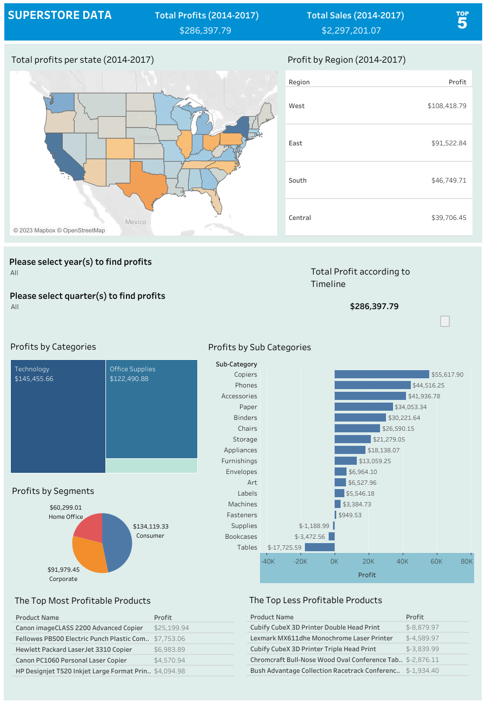

# Data Analytics for Superstore Sales

## Goal of the project

The purpose of this project is to identify the patterns in products, regions, categories and customer segments for efficiency and profit optimization. Main Business Objectives are:
+ How can we optimize our profits?
+ What are the emerging trends that we can we identify?
+ How can we take these insights to build recommendations?

 A Sales Dashboard from company data is developed using **Tableau** and the data analysis is done using **SQL** to answer above business objectives.

## Tableau Dashboard

The interactive Dashboard based upon Yearly and Quaterly sales aspects from 2014-2017 of collected data is shown in images below while subsequent link is also atatched:

[](https://public.tableau.com/app/profile/usama.zafar.qureshi/viz/SuperstoreData_16929735714910/yearly?publish=yes)

Click [here](https://public.tableau.com/app/profile/usama.zafar.qureshi/viz/SuperstoreData_16929735714910/yearly?publish=yes) for interactive tableau dashboard.

## Analysis Approach

The following set of questions and topics will be stringed out from data.\
Let’s load data into SQL and check the first 5 rows to make sure it imported well.

```SQL
Select TOP 5 *
FROM Superstore
```
### 1. What are total sales and total profits of each year?

First creating a year column from Date, which will be further use in analysis of data.
> To create a new column of year

``` SQL
SELECT DATEPART(YEAR, Order_Date) AS year
FROM Superstore

ALTER TABLE Superstore
ADD year INT

UPDATE Superstore
SET year = DATEPART(YEAR, Order_Date)
```
> To find the total sales and profit in each year
```SQL
SELECT year, SUM(sales) AS total_sales , SUM(profit) AS total_profit
FROM Superstore
GROUP BY year
ORDER BY year ASC
```
This query produced the following result:

<!--  -->
![](data:image/png;base64,iVBORw0KGgoAAAANSUhEUgAAAOIAAABjCAYAAACG/NyqAAAAAXNSR0IArs4c6QAAAARnQU1BAACxjwv8YQUAAAAJcEhZcwAAEnQAABJ0Ad5mH3gAAAAhdEVYdENyZWF0aW9uIFRpbWUAMjAyMzowODoyNiAxMzoxNzowN4A3GjUAABIiSURBVHhe7Z1NaBxHFsefdi972gR8CTnZ8YyCZF0MY2FGN2OUyDJBhEWGgBG+zNixdyVEFAIyOSwWBDsIyfmydAkiILAwRphIYwuhm0SwBb7ICusZr3RJ8CWQ5LSX3dmq6uqZ/qhXXT3TXxO/H7Q9XVNd/ep1vfpodf+nq86AhPn555/hzTfflHvZpBNszCLkNzVBfvmT/J8giBShQCSIDECBmAa1eRgYmIea3G2LKMvKOjHXtVIegK6uLihXZEKCUCCGwaQhvEqBYUpH+K0Cq4t9sF6vw0Je2pKgTRSIBMGpPYe9Yi/k+efcOGxvj0NOfJEQ/K5p0vz000/yU5PqXLEOJdYfSdZLUBe71bl6qQj8zm4diqX6XNX6nmWoF3ma2IqNvEWWp1RiZUGp3iwtPH4bq/W5hh1zbI8nuW1bV+VB7ZTfIwh/2MfYlQ4qC/GVsqyYSNVv4nt2/V1lO9LtduE7/3q91DiX9b27HP21MkHV5p1kJhCFsxrBwx3DP/MLVGwGn3CQwil2uiiD5V9v120aGxvntxpPSZ6r0ZFgNnKcdmJ5BHb9GaJOtl8c+MrCfGVQVoSk6jdZP1cHZJfdaBcG5zc9XwiCAjE7U1M2HbheWoRVvlCurMJiaQSGamuwsrMDE/kusYjuyk/Azs4KrPFJO5u/lwesxbVIF4UwiqMwPJTApILbBnMwJc+VGx6F4t5z/3oCs1NLHnqLi3COHVde64al6gIM8WRdWaivkLLSIla/Mdj0clheflfZdrswPX/CZGqNODRSgkUWiZXVPZibsptLSSygWacht20Yz1WgnF+B3utLVlp1Dtg0JoO0amcOxrdZ/qXr0Lt/A/L5MivJpCyVr1RlZZ1Oub7Rka2bNUMjUNo7B+f2WO/FO6zcMIyy3nx1XvZXrrtYfWzgsHq12tq+eY8ZFdw2mIBbFcua2toK7PR1Kxb4rdjJGmLXAMyzsWt8YQnminvwXJxGUxbqK6yslIjVb4ydfWvGxFCWbXz+ZMnYXdMhGGH+L44OS8ew3nxpHWAlb01RxvZhdInfzRqCqTmebE3Dxlb2RO7YyXWLi5jv4qMKt40ZccOyLb8yCtUFNoq78rRqJz+uTx6Xh5XRJTayBZWl85W3LHlIUiTmNwbraPbHrOMaZbtAzq/CZVO8ZOxZU9Z7D6zCyHbK6xgGPTPZGqn6jc8CxgCWkv7TgwGd86xppcx6qHOwNzqVehAmB582Wr23e4u/B+5sEL+FuamTMejtCwQaEVuD/Kamc0ZEgniFoUAkiAzQ9euvvyY+NeW8/vrrwM6d+f8JIgpee+01+UlNKmvE3377Df7z32wPxn/58/8yb2MWIb/54T4JCsTUPPbGkb/KT9mEj4gEkRSpBeLLX36Xn7IJTUuJJOnMEfHgBRweyM8xQSPiK0AC7cgUPBD50+8x/mE5aETcmjwrgpVv5++8kKkyvVCGawWWPrkhUyUHX8PUkXHYkrtOtibd5QQRZkT0ln14ZxzOC9vPwpTinN78WF1tnPkP7zTzNjdvnTeYH5zfn4VFu8Ft2raxMr3+SxjcD8xvmzJRVxcJdm2xdA7ajlLyjyIQazA/YD2lsChT4oBXFIU54wN4H35gwfryl6fw3upJ68KwQJvd5+mb8D1P378pL8oLWHyXOa/wCXzHd73w45bkZ0OMR0Rv2Wz/2jTA5C6zffdjgOmyu+F482N1tfHkP3p5U3RijW33MyiMDcMZ+X2TS7DcyLcJpWM8jTXqC99Cz12exs4Ff3OfK0lUfhDXlteJ+e2Cs3NR1UXiLccGS+fw75TtKD3/KAIxZ702U1+HkkyJA+5UlLPz8HL2Qzgqdo7D4Eg//FhjPduLf8Fub66Rnut9DFXR4R2H0kPuvHtwUXznhAXplfvQM9Yv980wGxGRsk+9DW/xxnJsEIbGbBs5ivxYXQXBtm99cR/e+/ug3JMc1OBHboPcbbC5Bt+d+gyunuU7zGezv8Mt8Tlp/PU6rD2Dwsg7lh+Y367OPIOK6HyRuggw/wT4DWtHKfqnA9aIL2Bj9TH05I5bF6v7uEwHeKvb2WgRNm/Dg96P4Wq33DfEaERUlX3sHdaT3ocN3sMebEBl/xIM2Rcz0JZmXQVB+WXPPugcIWye3IdrfJbAp1j2tJb5DxoNMEUU9TqaOwG7q4/gUOwxPzx/3Ly2iroIMP8E+A1rR2n6J7VA1I6IDg7vlOFTsHupsLCpxudsmjjrGTEMCB4RsbJZT/rN+/Dgylk4f+UmwEfzctoYbIu7rgb5H7Fe/yN7NPVw6n2Y/IZP8+5Bj2O6W4A1mLIbdSprRKRebGaw3HsfTjO73nj3NlTBMZop64L5J9hvOtLyT6ZHRH5j4toqm8s/RBpbAId3bsKPI/9QrJ+CCRoR0bLZKHX+CsCXD9n64+EC5D+3bi4E2eKta7DtG/DV6onmaOvk2Ifs3B/CGTk9vuqY7u7C23BVTOP52ij5NaKuXmdm5fr3IX+N+bGViNQFKyfYb3rS8k9mR0TeME+zhvmlIwjF9OV5c2rybzZ9aUzjfFjTvN3pkyLoT09bn7G7aF70IyJeNh+lwF7riDUfwINHG1pb/HUNtr2VBsf9V+h22mYwtY8U02vyAmr70MK11fvZBmtHafonmyMiG1WuTZ+AZUcQCo6/DYX9WmMdUdvvhzx2rfgUUfRs1vbDTD8UZp7C95fRA1zoR0S8bN9ahzWMntwgbouyrkG283IB3ntHXRfxJw42rRI2sHXqV9My79lh6Jm+DVvyTrNlm5k/okFTr81xZvPXwuZDtsb79Im1tlbXBfOnxs9OsHaUon8yOSJuffEJmyJ8Cx+wYOUByzfRq7FpyqRYR7D115GTYkHuupUdIS0/WeNc6wgb72nvvKF11XHAvh/x1p2tjeTfE49eXoBluGnZUGDr1JkFmXcQbt0FmC14bWsei3+OGe43sPx2+sIzuHjXWlvjdQmLoy5oO0rPP11pPfTNRxxdMGrhT0Sw3vVoTEHI4QHRsn2vMB310HcC7Yhj8tB3aoFIb1/8MSG/+aG3L9rA+MkagoiA1AIx69O+lteIBNECNCIi0IhIJElqUhkc3tj5yJPV/wkiKuhmTYvQTYfWIL/5yfTNGoIgmlAgEkQG6MxAzJDEQWg62XYiNpSBWCnLH4hk24D9M18JE41UBn8EySrD2vwyC1FgKmWhth23US0dgftGhU8uIiUpCBc6G3zXkBEyf5BUiQAp0+jYGPAHYqUM52AUqnX+ln4VRlfyUE76F1GYk6KTytDILEQBt8lEygK1naOwkftAJR2B+UaFxzYR9KlLZWA2YNcwZH5WZ61UiQAp0+jYePAH4tAC1Bfsn7XKwfBoEfaS/mXLqKQytDILURAgycBoSFlgtmM2ch/Yb2QcOw75U8+gxhsF5hsfCtuyIJWB2oBcw7D5OahUiUTnh6BjYyJgjViDtZUd6OtO89fmmq+jtCSVgcksREEIKQut7UE2HjyCB09OQM43mmte1VHYlgWpjLA2hLZZJ1UiQcs0ODYutIFYmx+DCfHD/zIhBdqTymAgkhHtw6Y37UhZONHYKNacbPoFM6q30THf4LalL5UR3oZw+dkIp5QqcaMu0+zYOEADsTY/AGP8Z41T/PVV3gjbkcrQSUa0S1tSFk4CbLTWnP61oM43OtvSlsrghLUhVH42C1FJlXhRlml4bBwoA5EHIf9t8TR/Apk3tPakMuLEmhLqJBm8wdCe7e61oMo3TXDb0pSCsAlrQ9j8aqkSd36sTJNj48IfiLV5GJvog/U0f4dc3L1qVyrDarBKyYi2sW8UWJuRlAViO2ajK10GlwhczDcNNLalLpXBCGtDyPyiw/NJlXjyI2UaHRsTvkCs3OK/Q74I5xy/TZ703xKjksqITmYhJCopC8R2zEZX+pEyVEeeijt7uLQGWxcGyjZkQSoDswEjZH5UqsRZF6RMo2Pj8U9XRz70nYDEQWwPLyckz5AW9NC3H5OHvjszEBOAGlRrkN/8mAQieYwgMgAFIkFkAApEgsgAqUplEMSrAt2saRG66dAa5Dc/dLOGIDoECkSCyACdGYidIDcRlY2dUFeibZSB2JTKGEj+7XxJNFIZDJ3MQrsgZWM2hpW+UJfDH6uy8tplqd4QUEs+mB0bN1o5Cs81FM/cumzmm/W92p9mdVT5XHeuuPEHIpfK2JNSGdXrAOfKkHgsRiaVwS6KShIhEpCyMRvDSl+gdeUEyH+wY3HJh5ilQ4JAbVNfQ1R6BPOnIKCOiM/Rc8nD4sQfiFwqw37zIpeH3uIeJK2UEZlURpzSEFjZiI3iDX37FRv+3uHMM6jwgAtbV1P5D5XkQ+zSIYYo5SiQa+jBlh5B/WlSR0O5kYbMSQLo14i1NVjZ6YNUlTIcr6MI54eQyggtsxACrGzMRt8rNs8fK2w3rGuQtIZO8iFO6RAT2pGjkLMELj2i9WeoOiKvOznOlQRoIPKXg7vyEwBzU5CiUgabt7cnlRGnNESosp2v2Lx7G6rgF5wyrmug/AcbXTDJh9ikQ0zR2BaAS3pE588QdcR8bixzEhFoIObGt9OTU5TwxXNbUhmMOKUhwpZ9ZlauQR7Os87tsUy1MK6rifwH682Vkg8xSocYg9kWiF96ROnPEHXEfW4ocxIh+qlpWnKKDO6kdqUyeP64pCGwss1s5G/oQyM9iro6SVPyIYhWbdNrBLn9aYLK5zbBekTR4wtEMSVlQ6AVeinJKYo7a+1LZcQqDYGVjdm4OQ5vTH4t0g83b8OnT+TaKGRdeQMKkv8QQayQfDA5Nm4w2/TwfB5bEX8a1RHzuUBxriTgz5q6qdbXS0X+/CnbivXSXFWmRwd/0JxNKdBteYyf270VZp7K7/rZfn+9wNPG7nmOvVe/CJfqy860u5dEXlGGLz++BdkoNqRszEYrnefvr1+8a6c162hv+ro+dZcj83rr3swT9ljss9lm4je1bfamOOfuvfo/Z7z51P40qaPO5+pztecf7pMguvg/zJBEeSWkMqKyMYG6Rgk99O3H5KHvzgzEBKAG1RrkNz8mgUgeI4gMQIFIEBmAApEgMgBJZRBEAtDNmhahmw6tQX7zQzdrCKJDoEAkiAzQmYFI8hHEHwxtIFbKyf8SlE04+QjJgbnMQrvoylZLOJikK96f89TJVApC4DuW262RqUiIsP6x2ZpUtIUWytG2i80YpVU04IFYm4cbi/Jz0iBSBrxhhZHKiFP6ILSEgy5dVVekThZBchfIseJhZ0xCIyHC+seGX/sl+ZnTajkMvF3EKa2iBwnEGsyPrUBfqSj3EyYqqQwPcUofNMrmtttP9R87DvlTz6DGG7suXSnbgNTJSO5C4w+lTEVyCOUBTDJE5R8B61iu3IeeMcfLv0h+tHwNjWsXp7RKAOpArNyClb7rMNUr91PF8RqPTj4iCDmaxiJ9gJV98AgePDkBOdN0R121tCp30Y5MRUT4XoNSSYZ4/bN5G/gPu17tlvteHPmNynfiuHa8fcUlrRKEIhArUL4BcH0hTYGMJu1KZdjEKX2gKlusQ9jUEGbcL5hi6ZzopDIwWpepiAw2kukkQ/z+YdPFz9l0elY9k/HlDyjfi/faxSmtosMXiLX5G7A3mq5OjQ13spF8RCBxSh+oy7bWIc41nwWWblzXduQuWO/fmkxFtOgkQ7z+CXpbXuVPXflu/NcuTmkVHZ5AtN7I35nIC4Hh/IT1OY07p7xhRiUfEaf0gb5s55rPiTtdVdc4yJ6EBiZxYftnQ0zVd6dPihHq9LT12T8dx/ysl9DwXjvevuKSVgnCE4g5GN+u87f2xVadK0Jxrgrb4x0qlSGIU/rAX7aYKtlSDeJ7hUyFIx2tK4KrnJByF63JVETMpoHERcO2QXnTydp+mOmHwsxT+P6yxp9I+X74MR7fxSmtEoD6Zk3KbH3xCZsifAsf8Hm+3EQvyKZlk2L+z9Y4R06KBXygUvUBO27EIF8rKMo+enkBluGmtUY5UobqyFNx5w1LR+uK4CqnwNZ5Mwvy/Pzvi/5b9S6c6yfhv3vyrqDzWOxzRHAbwLLh9IVncPGutU7F/IOB5kfK99VF2S4G4dZdgNlC8v7p6siHvhOQj6CHl1uD/Obnj/vQ97HO0XAhCBOo6yKIDECBSBAZgAKRIDIASWUQRMwE3ajhpHLXlCAINzQ1JYgMQIFIEBmAApEgMgAFIkGkDsD/AadM6s+ACf67AAAAAElFTkSuQmCC)

The data above shows how the profits over the years have steadily increased with each year being more profitable than the other despite having a fall in sales in 2015.

### 2. What are the total profits and total sales per quarter?

>To create a new column of quarter

``` SQL
SELECT year, 
CASE
WHEN DATEPART(month , Order_Date) IN (1,2,3) THEN 'Q1'
WHEN DATEPART(month , Order_Date) IN (4,5,6) THEN 'Q2'
WHEN DATEPART(month , Order_Date) IN (7,8,9) THEN 'Q3'
ELSE 'Q4'
END AS quarter
FROM Superstore
Order by year

ALTER TABLE Superstore
ADD quarter Varchar(10)

UPDATE Superstore
SET quarter = CASE
WHEN DATEPART(month , Order_Date) IN (1,2,3) THEN 'Q1'
WHEN DATEPART(month , Order_Date) IN (4,5,6) THEN 'Q2'
WHEN DATEPART(month , Order_Date) IN (7,8,9) THEN 'Q3'
ELSE 'Q4'
END
```

> To find the total sales and profit in each quarter
```SQL
SELECT year, quarter ,SUM(sales) AS total_sales , SUM (profit) as total_profit
FROM Superstore
GROUP BY year, quarter
ORDER BY year, quarter
```
This query produced the following result:

\

>Computing the table above through Excel gives us the following:

\
*Quarters performance from 2014–2017*

  <!-- 
  <figcaption> Quarters performance from 2014–2017
  </figcaption> -->

The result above shows that the period of October, November and December are best selling months with most profit.

### 3. What region generates the highest sales and profits ?

>To find the total sales and profit with respect to region

```SQL
SELECT region, SUM(sales) AS total_sales , SUM(profit) AS total_profit
FROM Superstore
GROUP BY region
ORDER BY total_profit DESC
```
This query produced the following result:


It can be observed that the West region is the one with the most sales and brings in the highest profits. The East region is pretty good looking. Those 2 regions are definitely areas of interest if company want to maximize our profits and expand business. Concerning the South region, it doesn't gain a lot of revenue but still the profits are there. It is the Central region that is quite alarming as it generates way more revenue than the South region but do not make at least the same profits over there. The Central region should be the one on watchlist.

> Let’s observe each regions profit margins for further analysis with the following code:

``` SQL
SELECT region, ROUND((SUM(profit) / sum(sales)) * 100,2) AS profit_margin
FROM Superstore
GROUP BY region
ORDER BY profit_margin DESC
```
This query produced the following result:


Profit margins are a measure of a company’s profitability and are expressed as the percentage of revenue that the company keeps as profit. So It can be seen that the West and East are really good. The South region despite almost selling less than half of the West region in revenue has a good profit margin of 11.93% which is great. However the Central region is still not convincing.

### 4. What state and city brings in the highest sales and profits?

#### States

Which states are the top and bottom 10 in term of total sales and profit and profit margin.

> For top 10 states, it can be found with the following code:

``` SQL
SELECT TOP 10 State , SUM(sales) AS total_sales , SUM (profit) as total_profit ,  ROUND((SUM(profit) / sum(sales)) * 100,2) AS profit_margin
FROM Superstore
GROUP BY State
ORDER BY Total_Profit DESC
```

This query produced the following result:


> For bottom 10 states, it can be found with the following code:

``` SQL
SELECT TOP 10 State , SUM(sales) AS total_sales , SUM (profit) as total_profit ,  ROUND((SUM(profit) / sum(sales)) * 100,2) AS profit_margin
FROM Superstore
GROUP BY State
ORDER BY Total_Profit ASC
```

This query produced the following result:


Our least profitable markets are listed above. The top 3 are Texas, Ohio and Pennsylvania. 

#### Cities

Which cities are the top and bottom 10 in term of total sales and profit and profit margin.

> For top 10 cities, it can be found with the following code:
> 
``` SQL
SELECT TOP 10 City , SUM(sales) AS total_sales , SUM (profit) as total_profit ,  ROUND((SUM(profit) / sum(sales)) * 100,2) AS profit_margin
FROM Superstore
GROUP BY City
ORDER BY Total_Profit DESC
```

This query produced the following result:


The top 3 cities that we should focus on are New York City, Los Angeles and Seattle.

> For bottom 10 cities, it can be found with the following code:
> 
``` SQL
SELECT TOP 10 City , SUM(sales) AS total_sales , SUM (profit) as total_profit ,  ROUND((SUM(profit) / sum(sales)) * 100,2) AS profit_margin
FROM Superstore
GROUP BY City
ORDER BY Total_Profit ASC
```

This query produced the following result:


The bottom 3 are Philadelphia, Houston and San Antonio.

### 5. The relationship between discount and sales and the total discount per category.

> For observing the correlation between discount and average sales.

```SQL
SELECT discount, AVG(sales) AS avg_sales
FROM Superstore
GROUP BY discount
ORDER BY discount
```

This query produced the following result:


Seems that for each discount point, the average sales seem to vary a lot.

> To find the highest discount rate for avg sales

```SQL
SELECT discount, AVG(sales) AS avg_sales
FROM Superstore
GROUP BY discount
ORDER BY avg_sales DESC
```
This query produced the following result:


They almost have no linear relationship. However it is at least observed that at a 50% discount, average sales are the highest it can be.

> For observing the total discount per product category.

```SQL
SELECT category, MAX(discount) AS total_discount
FROM Superstore
GROUP BY category
ORDER BY total_discount DESC
```
This query produced the following result:


So Office supplies are the most discounted items followed by Furniture and Technology.

> To zoom in the category section to see exactly what type of products are the most discounted.

```SQL
SELECT category, sub_category, MAX(discount) AS total_discount
FROM Superstore
GROUP BY category , sub_category
ORDER BY total_discount DESC
```
This query produced the following result:


Binders, Phones and Furnishings are the most discounted items.

### 6. What category generates the highest sales and profits in each region and state?

> To observe the total sales and total profits of each category with their profit margins:

```SQL
SELECT category, SUM(sales) AS total_sales, SUM(profit) AS total_profit, ROUND(SUM(profit)/SUM(sales)*100, 2) AS profit_margin
FROM Superstore
GROUP BY category
ORDER BY total_profit DESC
```
This query produced the following result:


Out of the 3, it is clear that Technology and Office Supplies are the best in terms of profits. Plus they seem like a good investment because of their profit margins. Furnitures are still making profits but do not convert well in overall.

> To observe the highest total sales and total profits per Category in each region:

```SQL
SELECT region, category, SUM(sales) AS total_sales, SUM(profit) AS total_profit
FROM superstore
GROUP BY region, category
ORDER BY total_profit DESC
```
This query produced the following result:


These are best categories in terms of total profits in each region. The West is in top 3 two times with Office Supplies and Technology and the East with Technology. Among the total profits, the only one that fails to break even is the Central Region with Furniture where it is operated at a loss when selling it there.

> To see the highest total sales and total profits per Category in each state:

```SQL
SELECT state, category, SUM(sales) AS total_sales, SUM(profit) AS total_profit
FROM Superstore
GROUP BY state, category
```
This query produced the following result:


The table above shows the most performing categories in each state. Technology in New York and Washington and Office Supplies in California. The 3 categories are all around good for top 3 markets except the furniture category in Washington which is good but not as great as the others.

### 7. What subcategory generates the highest sales and profits in each region and state?
> To observe the total sales and total profits of each subcategory with their profit margins:
```SQL
SELECT sub_category, SUM(sales) AS total_sales, SUM(profit) AS total_profit, ROUND(SUM(profit)/SUM(sales)*100, 2) AS profit_margin
FROM Superstore
GROUP BY sub_category
ORDER BY total_profit DESC
```

This query produced the following result:


Out of total 17 subcategories nationwide, the biggest profits comes from Copiers, Phones, Accessories and Paper. The profits and profit margins on Copiers and Papers especially are interesting for the long run. Losses came from Tables, Bookcases and Supplies where company is uncapable of breaking even.

> To see the highest total sales and total profits per subcategory in each region:

```SQL
SELECT region, sub_category, SUM(sales) AS total_sales, SUM(profit) AS total_profit
FROM Superstore
GROUP BY region, sub_category
ORDER BY total_profit DESC
```
This query produced the following result:


These above display the best subcategories per region.

> To see the highest total sales and total profits per subcategory in each state:

```SQL
SELECT state, sub_category, SUM(sales) AS total_sales, SUM(profit) AS total_profit
FROM Superstore
GROUP BY state, sub_category
ORDER BY total_profit DESC
```
This query produced the following result:


Machines, Phones and Binders perform very well in New York. Followed by Accessories and Binders in California and Michigan respectively.

### 8. What are the names of the products that are the most and least profitable to us?

> To get most profitable products, following query is made:
> 
```SQL
SELECT product_name, SUM(sales) AS total_sales, SUM(profit) AS total_profit
FROM Superstore
GROUP BY product_name
ORDER BY total_profit DESC
```
This query produces the following results:


These Copiers, Machines and Printers are definetly the main foundations of profits. The Canon imageClass 2200 Advanced Copier, Fellowes PB500 Electric Punch Plastic Comb Binding Machine with Manual Bind and the Hewlett Packard LaserJet 3310 Copier are top 3.

> To get least profitable products, following query is made:

```SQL
SELECT product_name, SUM(sales) AS total_sales, SUM(profit) AS total_profit
FROM Superstore
WHERE profit IS NOT NULL
GROUP BY product_name
ORDER BY total_profit ASC
```
This query produces the following results:


The Cubify CubeX 3D Printer Double Head Print, Lexmark MX611dhe Monochrome Laser Printer and the Cubify CubeX 3D Printer Triple Head Print are the products that operate the most at a loss.

### 9. What segment makes the most of our profits and sales?

> This can be verified with the help of the following query:

```SQL
SELECT segment, SUM(sales) AS total_sales, SUM(profit) AS total_profit
FROM Superstore
GROUP BY segment
ORDER BY total_profit DESC
```

The above query produces the following results:


The consumer segment brings in the most profit followed by Corporate and then Home office.

### 10. How many customers do we have in total and how much per region and state?

> Total number of customers can be found by:
```SQL
SELECT COUNT(DISTINCT customer_id) AS total_customers
FROM Superstore
```
The above query produces the following results:


Company had 793 customers between 2014 and 2017.

> Total number of customers based upon region:
```SQL
SELECT region, COUNT(DISTINCT customer_id) AS total_customers
FROM Superstore
GROUP BY region
ORDER BY total_customers DESC
```
The above query produces the following results:


Company had customers moving around regions which explains why they all do not add up to 793. Since there could be double counting. The West is the area where it has the biggest market of all.

> Total number of customers based upon state:
```SQL
SELECT state, COUNT(DISTINCT customer_id) AS total_customers
FROM Superstore
GROUP BY state
ORDER BY total_customers DESC
```
The above query produces the following results:


Company have the most customers in California, New York and Texas.

### 11. Customer rewards program

To build a loyalty and rewards program in the future. What customers spent the most with company? That is generated the most sales. It is always important to cater for best customers and see how company can provide more value to them as it its cheaper to keep a current customer than it is to acquire a new one.

> To check the customers with most business and profit with the company:
```SQL
SELECT TOP 15 customer_Id, SUM(sales) AS total_sales, SUM(profit) AS total_profit
FROM superstore
GROUP BY customer_id
ORDER BY total_sales DESC
```
The above query produces the following results:


The display of the customer names are on file but showing the unique Customer id is a form of pseudonymization for security reasons. What is actually interesting to see is that customer ID ‘SM-20320’ is the customer who spent the most but is not bringing most profit. But company still have to reward his/her loyalty. It is customer ID ‘TC-20980’ who is second in the list but brings the most profit.

### 12. Average shipping time per class and in total

> To find the average shipping time regardless of the shipping mode:

```SQL
SELECT TOP 1 DATEDIFF (day, order_date, ship_date) AS avg_shipping_time
FROM Superstore
```

The above query produces the following results:


> To find the shipping time in each shipping mode:

```SQL
SELECT ship_mode , avg(DATEDIFF(day, order_date, ship_date)) AS avg_shipping_time
FROM Superstore
GROUP BY ship_mode
ORDER BY avg_shipping_time
```
The above query produces the following results:


Data shows, on average it takes 5 days to deliver product to customer on standard class.

## Datasets Used
The datasets used:
+ Comes with 9995 rows with 9994 being pure data and the other one row being the column headers.
+ This company sales data recorded between 3rd of January to 5th if January 2018.
+ It contains the data of 793 customers.
+ The data is publicly available through Kaggle under https://www.kaggle.com/datasets/vivek468/superstore-dataset-final

## Built with
+ SQL Server Management Studio
+ Tableau

## Authors
+ Usama Qureshi - [Github Profile](https://github.com/usamaqureshi27)